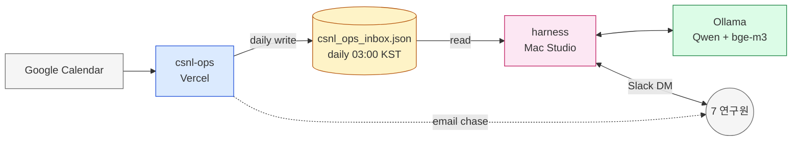
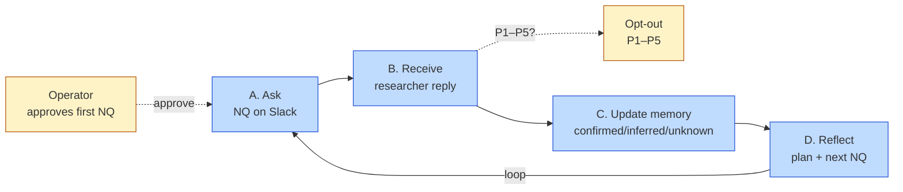
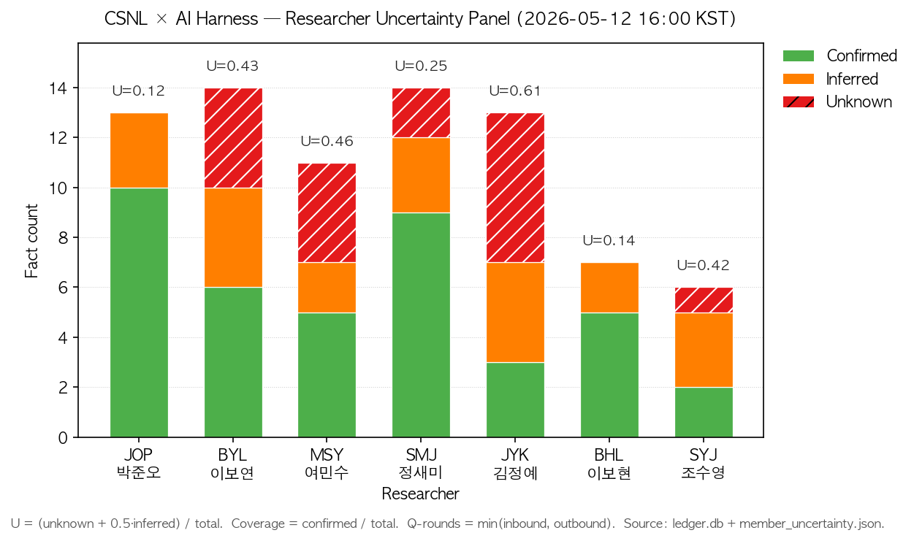
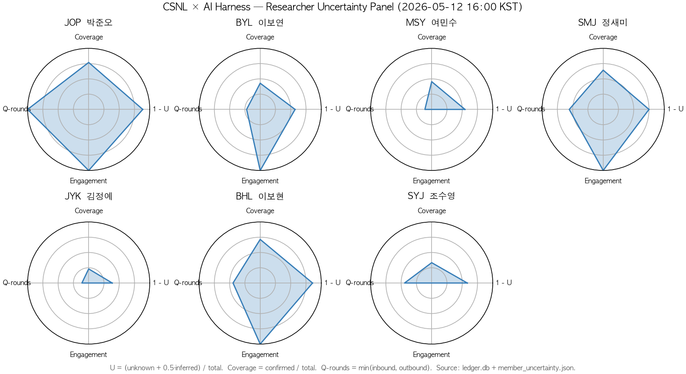
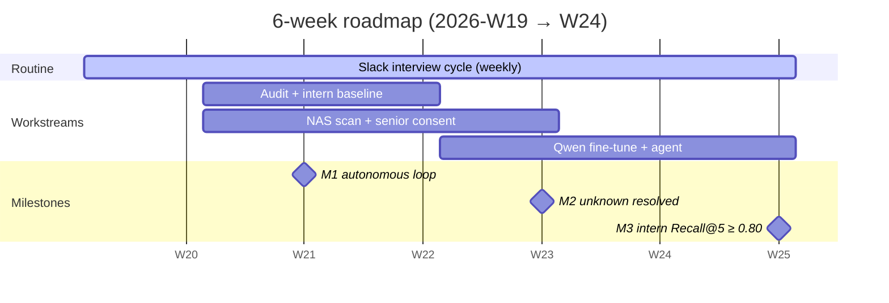

# CSNL-Ops × AI Harness — Researcher Uncertainty Closed-Loop Engine

> **한 줄 요약.** 본 저장소(`csnl-ops`)와 자매 시스템(`_lab_ai_harness`)은 7인의 junior researcher 대상으로 진행되는 Slack-DM 인터뷰 사이클을 **연구원 × 프로젝트 × NAS 경로** 단위의 polynomial 우연성(uncertainty) closed-loop 으로 운영하는 *과학 자동화 엔진*이다.
>
> **상태 (2026-05-12 16:30 KST).** Phase F (csnl-ops) + harness Mac mini→Mac Studio 마이그레이션 완료. 5/8 이후 작업 PR #1–#4 (meta-review, closed-loop, uncertainty-pipeline, ingest-experiments) 모두 `main` merge 완료. 본 브랜치 `docs/readme-workflow-2026-W19` 는 본 README + diagrams + figures 추가 PR 후보. Slack 인터뷰 cycle 6/14 라운드 가동 중. 활성 캠페인 `paperblitz_2026_05_06`. 7 연구원 모두 NQ active.

---

## 초록 (Abstract)

연구실 운영지식 — Slab/CSNL 캘린더, NAS 실험데이터 lineage, 주간 Paper Blitz/GRM/CWLL 발표자료 메타 — 을 단일 데이터베이스로 통합하는 동시에, 그 통합된 상태를 *연구원과의 자연어 대화*에 의해 점진적으로 정련(精鍊)하는 시스템을 구축한다. 본 시스템은 (i) NAS 경로별 *uncertainty surfacing*, (ii) 한국어 학술체 `next_question` 생성, (iii) Slack DM 발사 및 응답 수집, (iv) Qwen 3.6 MoE 기반 *memory delta* 계산, (v) `member_uncertainty.json` 및 `researcher_topics.json` 의 atomic mutation, (vi) plan revision 의 8-단계 폐회로(closed loop)로 구성된다. 현재 7인 연구원에 대해 총 **32건 inbound × 38건 outbound** 의 1차 라운드가 누적되었고, 평균 우연성 점수 *U* = 0.346 (σ = 0.169), 평균 NAS chunk coverage = 42.3건 으로 측정된다. 본 README 는 (a) 시스템 설계 목표, (b) 구현 현황, (c) 연구원별 uncertainty 매트릭, (d) naive agent / intern 의 자연어 DB query 능력을 평가하는 매트릭 후보 및 예시 프롬프트, (e) 향후 6주 마일스톤을 제시한다.

---

## 목차

- [§1. 서론 — 시스템 설계 목표](#1-서론--시스템-설계-목표-system-design-goals)
- [§2. 아키텍처 개요 (Figure 1)](#2-아키텍처-개요-figure-1)
- [§3. 방법 — 8단계 폐회로 (Figure 2)](#3-방법--q-a--memory--plan-폐회로-figure-2)
- [§4. 구현 현황](#4-구현-현황-implementation-status)
- [§5. 결과 — 연구원별 마일스톤 및 우연성 매트릭 (Figure 3)](#5-결과--연구원별-마일스톤-및-우연성-매트릭-figure-3)
- [§6. Discussion — naive-agent DB queryability](#6-discussion--naive-agent-db-queryability)
- [§7. 로드맵 — 마일스톤 (Figure 4)](#7-로드맵--마일스톤-figure-4)
- [§8. 운영 정책 quick reference](#8-운영-정책-quick-reference)
- [Appendix A — Toolchain · skill · hook 카드](#appendix-a--toolchain--skill--hook-카드)
- [Appendix B — 용어집 (Glossary)](#appendix-b--용어집-glossary)
- [Appendix C — 파일 인벤토리](#appendix-c--파일-인벤토리)

---

## 1. 서론 — 시스템 설계 목표 (System Design Goals)

랩 운영의 큰 페인포인트는 (i) **사실의 분산** (NAS, Google Calendar, Slack, 발표 슬라이드, GRM 노트가 별도 형식으로 흩어짐), (ii) **추적의 비대칭** (PI · 운영자 한 명이 다수의 연구원을 사후 추궁), (iii) **지식의 휘발성** (논자시·졸업으로 멤버가 이동하면 프로젝트 상태가 함께 사라짐) 이다. 본 시스템은 세 가지 설계 목표(G1–G3)로 위 문제를 해결한다.

| ID | Goal | 측정 가능 성공 기준 (KR-2026-Q2) |
|---|---|---|
| **G1** | 추궁 대체 — 운영자 한 명의 manual chase 를 closed-loop ledger 로 대체한다. | Slack DM (chase-mm / NQ) 의 manual 발사 비율 ≤ 5% / 주 |
| **G2** | 우연성의 표면화 — 각 연구원 × 프로젝트에 대해 *무엇을 모르는지*(unknown), *추론한 것*(inferred), *확정한 것*(confirmed) 을 atomic JSON 으로 유지한다. | `state/member_uncertainty.json` 의 unknown 항목이 매 사이클마다 ≥ 1건 해소 (또는 갱신) 됨 |
| **G3** | DB 의 자연어 질의 가능성 — naive intern 이 `csnl_v3` + `csnl_ops.*` + `ledger.db` 에 대해 자연어로 질의했을 때 *citation-grounded* 답변을 받을 수 있어야 한다. | §6 정의 매트릭 — Recall@5 ≥ 0.80, Grounding rate ≥ 0.95 (TBD, baseline 미측정) |

본 시스템은 단일 코드베이스가 아니라 **두 layer 의 협력**으로 작동한다 (§2). 운영 layer (`csnl-ops`, this repo) 는 캘린더·NAS lineage·Gmail 채널을 담당하고, 인터뷰 layer (`_lab_ai_harness`) 는 Slack DM · 메모리 진화 · uncertainty surfacing 을 담당한다. 두 layer 의 단일 정식 contract 는 NAS 상의 `csnl_ops_inbox.json` 한 파일이다 ([§ HARNESS_BRIDGE.md](docs/HARNESS_BRIDGE.md)). 보조적으로 주 1 회 `csnl_ops_snapshot.json` (전체 view) 가 일요일 04:00 KST 에 갱신되며, ingest-experiments 가 추가로 `experiments_snapshot.json` 을 함께 쓴다 — 모두 *csnl-ops → harness* 단방향이다.

---

## 2. 아키텍처 개요 (Figure 1)

**Figure 1.** 두 층(layer)이 *파일 한 개*를 사이에 두고 협력한다. 왼쪽은 운영, 오른쪽은 인터뷰.



> 편집용 source: [`docs/diagrams/architecture.drawio.xml`](docs/diagrams/architecture.drawio.xml).

세 가지만 기억하면 된다.
- **csnl-ops** (파랑) — 캘린더 가져오기 + 발표자료 chase email + Supabase 쓰기.
- **harness** (분홍) — Slack DM 듣기/말하기 + 메모리 업데이트 + 로컬 LLM 호출.
- **`csnl_ops_inbox.json`** (노랑, NAS 위) — 두 층이 만나는 *유일한 파일*. 운영이 매일 03:00 KST에 한 번 쓰고, 인터뷰는 그걸 읽는다.

부수 규칙 두 가지:
- Vercel은 NAS를 못 본다 → NAS를 만지는 작업은 Mac Studio의 launchd 스크립트에서만 돈다.
- 새 외부 호출(메일·DM·캘린더 쓰기)의 *첫* 발사는 사용자 확인이 필요하다. harness의 `memev_autofire`만 이미 표준 승인됨.

자세한 ownership 경계는 [`docs/automation-topology.md`](docs/automation-topology.md) 참고.

---

## 3. 방법 — Q&A 루프 (Figure 2)

한 사이클은 네 단계로 단순하게 본다: **A. 묻기 → B. 받기 → C. 메모리 업데이트 → D. 다시 묻기**.

**Figure 2.** 4-단계 Q&A 루프.



> 편집용 source: [`docs/diagrams/closed-loop.drawio.xml`](docs/diagrams/closed-loop.drawio.xml).

**누가 무엇을 하나** (코드 위치는 §4.3 모듈 카탈로그에 있음):

| 단계 | 무엇이 일어나나 | 트리거 |
|---|---|---|
| **A. Ask** | 본인 응답이 처음이면 사람이 초안을 검수한 뒤 발사. 이후 사이클은 메모리에 저장된 *next_question* 을 그대로 발사. | 사람 (첫 회) / cron (이후) |
| **B. Receive** | Slack Socket Mode 가 응답을 받아 `ledger.inbound_messages` 에 기록. `P1`–`P5` 코드가 보이면 opt-out 정책 갱신. | continuous |
| **C. Update memory** | Qwen 3.6 MoE 가 응답을 읽고 `confirmed / inferred / unknown` 항목을 갱신. 같은 말 되돌려주는 *parrot* 은 가드로 차단. | inbound 도착 직후 |
| **D. Reflect** | 갱신된 메모리 + topic queue 에서 다음 질문을 정한다. weekly 일요일 06:00 KST 의 consolidation cron 이 30일 이상 묵은 항목을 정리. | inline + weekly cron |

상세 step-by-step 은 [`docs/uncertainty-pipeline-2026-W19.md`](docs/uncertainty-pipeline-2026-W19.md) 의 8-stage 분해 참고 (본 README 의 4단계는 그 분해의 압축).

---

## 4. 구현 현황 (Implementation Status)

### 4.1 Cron matrix

**csnl-ops 측 (GH Actions → Vercel cron)** — **5 active workflows**, 모두 `CRON_SECRET` Bearer 검증. GH Actions cron 표기는 UTC 이며 KST 발사 시각을 별도 표기한다.

| UTC cron | KST 발사 | Workflow | Route | Effect |
|---|---|---|---|---|
| `0 */6 * * *` | 매 6h | `csnl-sync-slab-cron.yml` | `/api/cron/sync-slab` | Slab 캘린더 → `experiment_bookings` |
| `5 */12 * * *` | 매 12h (+5m) | `csnl-sync-csnl-mm-cron.yml` | `/api/cron/sync-csnl-mm` | CSNL "Meeting: INIT" → `milestone_meetings` |
| `10 */12 * * *` | 매 12h (+10m) | `csnl-sync-lab-meetings-cron.yml` | `/api/cron/sync-lab-meetings` | CSNL GRM 이벤트 + 자료 reconcile + presenter 추론 |
| `0 5 * * 5` | 금 14:00 KST | `csnl-chase-mm-slides-cron.yml` | `/api/cron/chase-mm-slides` | 3일 grace 후 `slides_path IS NULL` 연구원에 한국어 chase 이메일 |
| `0 18 * * 0` | 월 03:00 KST | `csnl-ingest-experiments-cron.yml` | `/api/cron/ingest-experiments` | lab-reservation 의 `public.*` (동일 Supabase 프로젝트) → `csnl_ops.behavioral_experiments` 미러로 ingest |

**csnl-ops 측 (로컬 launchd, NAS 접근)** — Vercel 런타임은 NAS 마운트가 없으므로, NAS-touching 작업은 모두 Mac Studio 의 launchd 에서 실행한다. *이들 스크립트는 Supabase API 와 NAS 파일에 직접 쓰며, `/api/cron/*` 를 경유하지 않는다.*

| Schedule (KST) | plist | Script | Effect |
|---|---|---|---|
| 02:00 daily | `work.csnl.resolve-mm-slides.plist` | `scripts/resolve-mm-slides.mjs` | NAS slide 존재 probe → `milestone_meetings.slides_path` upsert (Supabase 직접 쓰기) |
| 03:00 daily | `work.csnl.export-anomalies.plist` | `scripts/export-anomalies-for-harness.mjs` | Supabase `sync_anomalies WHERE pushed_to_harness_at IS NULL` 읽기 → NAS `state/csnl_ops_inbox.json` 작성 |
| 04:00 Sun | `work.csnl.export-snapshot.plist` | `scripts/export-snapshot-for-harness.mjs` | Supabase view 읽기 → NAS `state/csnl_ops_snapshot.json` 작성 |

**One-off / debug scripts (launchd 아님)**: `announce-pb-recommendations.mjs`, `announce-mm-convention.mjs`, `sync-slab.mjs` (CLI 변형), `list-calendars.mjs`, `peek-csnl.mjs` / `peek-csnl-grm.mjs` / `peek-slab.mjs`, `smoke-ingest-experiments.mjs`, `verify-csnl-ops-schema.sql`. 운영자가 수동 호출.

**_lab_ai_harness 측 (Mac Studio user crontab + launchd)** — 9 cron + 3 launchd.

```cron
PATH=/sbin:/usr/sbin:/usr/bin:/bin:/opt/homebrew/bin
HARNESS_ROOT=/Users/csnl/csnl_on_ai/harness

*/10 9-21 * * 1-6  bin/harness-runner.sh         # full-mode ack + reminder + queue
*/10 * * * *       bin/memory-evolution.sh       # Qwen3.6 MOE delta + autofire
*/10 * * * *       bin/mirror-to-nas.sh          # afpfs-safe rsync, EPERM→errlog
0 4 * * *          code/meeting_indexer.py       # NAS GRM+MM scan → meeting_index.json
30 4 * * *         code/pgvector_grm_sync.py     # pptx/pdf → bge-m3 → csnl_v3
0 22 * * *         code/session_meta_review.py   # daily audit → docs/session_meta_reviews/
0 6 * * 0          code/memory_consolidator.py   # weekly Sun consolidation
30 9 * * 1-6       code/weekly_corpus_sync.py --mode=light
30 9 * * 0         code/weekly_corpus_sync.py --mode=digest

# ~/Library/LaunchAgents/
csnl.realtime       # Slack Socket Mode (KeepAlive on crash)
csnl.orchestrator   # */15 9-21 CalendarInterval, poll-only
csnl.health         # */60s health probe
```

### 4.2 DB 스키마 — 3 데이터 plane

**Plane A — Supabase Postgres (`csnl_ops.*`, same project as lab-reservation).**
운영 lineage (캘린더, MM 슬라이드, GRM 발표자, anomaly queue, completed experiment mirror). 두 앱이 *동일* Supabase 프로젝트에 공존하므로 FDW 없이 cross-schema `SELECT public.bookings ...` 가 직접 가능. **10 migrations**:

```text
20260501000001_csnl_ops_schema.sql                # csnl_ops schema bootstrap
20260504000001_csnl_ops_seed_initial.sql          # researchers · projects · grants seed
20260505000001_projects_enrichment.sql            # project full_name · software[]
20260505000002_lab_meetings_backfill.sql          # NAS GRM/PB 발표 backfill
20260505000003_grants_enrichment.sql              # grant code · category · PI
20260505000004_lab_meetings_pk_fix.sql            # composite PK → uuid + unique natural key (PB presenter NULL 허용)
20260505000005_csnl_ops_grants.sql                # service_role + authenticated grants
20260508000001_yaml_corrections.sql               # YAML roster 정합
20260508000002_anomaly_push_tracking.sql          # sync_anomalies.pushed_to_harness_at
20260512120001_behavioral_experiments_mirror.sql  # csnl_ops.behavioral_experiments + experiment_ingest_anomalies (FDW 없이 cross-schema read)
```

> *과거 기록.* `20260512120000_lab_reservation_fdw.sql` 가 2026-05-12 16:17 KST 의 `2c51004 refactor(ingest-experiments)` 커밋에서 제거되었다. 동일 Supabase 프로젝트 공존이라는 사실이 파악된 후 FDW 우회는 불필요 — 같은 commit message 참고. 본 README 의 이전 draft 가 11 migrations 로 표기했던 것은 이 시점에 정리되었다.

**csnl_ops 의 테이블 개수**: 운영 12 개 (`researchers, experiment_bookings, lab_meetings, milestone_meetings, cwll_entries, annual_events, nas_datasets, grants, projects, sync_anomalies, grm_presenters_observed, special_grm_presenters`) + ingest 2 개 (`behavioral_experiments`, `experiment_ingest_anomalies`) = **14 tables**.

**Plane B — Postgres `csnl_v3` (Mac Studio local, pgvector 활성).**
인터뷰 layer 의 사실 그라운딩. `lab_meeting_metadata` (87 rows) × `grm_history_embeddings` (296 rows, 1024-dim `bge-m3` embedding). [`HANDOFF.md` §3.2](docs/HANDOFF.md) 의 schema 참고.

**Plane C — SQLite `state/ledger.db`.**
Slack 대화 ledger + audit. 18 tables. 핵심:

| Table | Purpose | Live rows (2026-05-12 16:00) |
|---|---|---|
| `inbound_messages` | DM 인입, idem_key=(channel:ts), researcher_init, intent | 31 |
| `bot_outbound_messages` | bot 발사 audit, kind, sent_at | 38 |
| `outbound_questions` | NQ campaign tracking (Codex Issue 3 — populating 예정) | 0 |
| `feedback_events`, `recommendation_messages`, `paper_recommendations` | paper rec audit + feedback | — |
| `blocked_paths`, `exclusion_rules` | NAS 탐사 차단 정책 | — |
| `verification_audit` | ledger ↔ Slack permalink reality check | — |

### 4.3 모듈 카탈로그 (요약)

**`csnl-ops` (Next.js 16 App Router).** 자세한 module-level docstring 은 [`docs/module-catalog.md`](docs/module-catalog.md) (file docstring 헤더에서 자동 추출).

- `src/app/api/cron/*` — 5 routes (sync-slab, sync-csnl-mm, sync-lab-meetings, chase-mm-slides, ingest-experiments).
- `src/lib/sync/*` — calendar event parsers (`parse-slab.ts`, `parse-mm.ts`), upserts (`slab-upsert.ts`, `mm-upsert.ts`), GRM reconcile (`reconcile-grm.ts`), anomaly recorder (`anomalies.ts`).
- `src/lib/google/*` — service-account `auth.ts` + `calendar.ts` event fetch.
- `src/lib/mail/*` — Nodemailer transport, Gmail SMTP, KO chase template.
- `src/lib/auth/cron-secret.ts` — `x-cron-secret` header verification.
- `src/lib/supabase/admin.ts` — service-role client factory.
- `scripts/*.mjs` — launchd: `resolve-mm-slides`, `export-anomalies-for-harness`, `export-snapshot-for-harness`, `announce-pb-recommendations`, `announce-mm-convention`, `sync-slab` (manual).
- `supabase/migrations/*.sql` — 11 migrations, schema source of truth.
- `.github/workflows/csnl-*-cron.yml` — 4 (+1 예약) GH Actions cron.

**`_lab_ai_harness` (Mac Studio, Python 3.13).**

| Layer | Modules | Role |
|---|---|---|
| Interface | `code/realtime_listener.py`, `code/slack_outbound.py`, `code/_send_bot.py` | Slack Socket Mode, outbound chokepoint, tone lint |
| Cycle | `code/harness_runner.py`, `code/orchestrator_loop.py` | full-mode ack + reminder + queue, poll-only spawn |
| Memory | `code_v3/memory_evolution.py`, `code/memory_consolidator.py`, `code/topic_switcher.py` | Qwen3.6 MoE delta + autofire, weekly consolidation, topic queue |
| Index | `code/meeting_indexer.py`, `code/pgvector_grm_sync.py` | NAS GRM/MM scan, pptx/pdf → bge-m3 embed |
| Audit | `code/ledger.py`, `code/ledger_audit.py`, `code/session_meta_review.py` | sqlite session, Slack permalink reality check, daily audit |
| Policy | `code/nas_optout.py`, `code/nas_barrier.py`, `code/task_runners/explore_path.py` | (P1)–(P5) policy, NAS access timeout cache, opt-out gated explore |
| Corpus | `code/weekly_corpus_sync.py` | weekly digest + corpus dedup |
| Bridge | `code_v3/llm.py`, `code_v3/dispatcher.py`, `code_v3/worker.py` | Ollama wrapper, dispatch |

---

## 5. 결과 — 연구원별 마일스톤 및 우연성 매트릭 (Figure 3)

### 5.1 매트릭 정의 (formula-transparent)

본 시스템은 *Slack DM 이력 (ledger.db)* + *member_uncertainty.json* 만으로 reliable 한 단일 점수를 산출하지 않는다. 대신 **세 개의 직교 매트릭** 으로 분해하여 보고한다. 각 매트릭의 분자/분모는 다음과 같다.

| 매트릭 | 정의 | 해석 |
|---|---|---|
| **Uncertainty score U** | `U = (unknown + 0.5·inferred) / max(confirmed + inferred + unknown, 1)` ∈ [0, 1] | 0 → 완전 확정, 1 → 완전 미지. `inferred` 는 가중치 0.5 (`confirmed` 와 `unknown` 의 중간값으로 취급). |
| **Coverage C** | `C = confirmed / max(confirmed + inferred + unknown, 1)` ∈ [0, 1] | 직접 답변으로 확정된 사실의 비율. C 가 높을수록 *DB grounding* 강함. |
| **Q-rounds Q** | `Q = min(#inbound, #outbound)` per researcher | 실제 closed 한 Q→A 라운드 횟수 (단순 동시 발사 ≠ 1 라운드). |
| **Silence (h) S** | `S = now - last_inbound_at` (KST naive) | 24 h 미만 = active, 24–72 = cooling, 72 h 이상 = stale → operator review queue. |
| **NAS chunk K** | `K = COUNT(grm_history_embeddings WHERE researcher_init = X)` | bge-m3 1024-dim chunk 개수. *NAS grounding* 의 정량적 surrogate. |
| **Topic priority** | `P1_open` = #(topic.priority=1 AND status ∈ {open, awaiting_deadline}) | 우선순위 1 활성 프로젝트 수. |

**왜 한 매트릭이 아닌가.** *U 와 C 는 보완적이다.* 예컨대 BHL 의 경우 *U* = 0.083 (낮은 우연성) 이지만 NAS chunk *K* = 0 (no own NAS folder; SK 의 senior workspace 학습 중). 단일 점수 (예: `U/C`) 는 이 두 *서로 다른 종류의 무지* 를 동일한 통계량으로 평탄화한다. 대신 본 시스템은 **U + Q + K + Silence** 의 4-축 panel 로 보고한다.

**왜 Q-rounds 가 `min(in, out)` 인가.** 한 라운드는 *질문* + *응답* 의 짝이다. JOP 처럼 out=9, in=10 이면 Q=9 (한 inbound 는 다음 outbound 의 trigger 가 아직 안 됨). MSY 처럼 out=4, in=1 이면 Q=1 (3 개 outbound 는 답이 없음 — operator review).

### 5.2 패널 (2026-05-12 16:00 KST 기준)

| INIT | Name | Conf | Inf | Unk | **U** | **C** | In | Out | **Q** | **Silence (h)** | Eng | **NAS chunks** | NAS folder |
|---|---|---:|---:|---:|---:|---:|---:|---:|---:|---:|---|---:|---|
| **JOP** | 박준오 | 10 | 3 | 0 | **0.115** | 0.769 | 10 | 9 | **9** | 0.5 | 🟢 active | **219** | Y |
| **BYL** | 이보연 | 6 | 4 | 4 | 0.429 | 0.429 | 2 | 6 | 2 | 19.0 | 🟢 active | 0 | Y |
| **MSY** | 여민수 | 5 | 2 | 4 | 0.455 | 0.455 | 1 | 4 | 1 | 93.6 | 🔴 stale | 76 | Y |
| **SMJ** | 정새미 | 9 | 3 | 2 | 0.250 | 0.643 | 5 | 6 | 5 | 0.3 | 🟢 active | 0 | Y |
| **JYK** | 김정예 | 3 | 4 | 6 | **0.615** | 0.231 | 1 | 5 | 1 | 97.4 | 🔴 stale | 1 | Y |
| **BHL** | 이보현 | 5 | 1 | 0 | **0.083** | 0.833 | 6 | 4 | 4 | 0.6 | 🟢 active | 0 | N (onboarding gap) |
| **SYJ** | 조수영 | 2 | 3 | 1 | 0.417 | 0.333 | 6 | 4 | 4 | 95.6 | 🔴 stale | 0 | N (onboarding gap) |

**관측.**
- **최저 *U* (BHL = 0.083) 와 최고 NAS chunk (JOP = 219) 가 다른 사람.** BHL 은 NAS workspace 가 아직 없는 onboarding 단계라 *Q 의 정량성* 이 작고, JOP 은 다년차 senior 라 NAS corpus 가 두텁다. 이는 *uncertainty 와 grounding 은 분리 측정* 해야 함을 보여주는 핵심 사례.
- **3 인이 stale (silence > 72 h).** MSY/JYK/SYJ. 모두 5/8 마지막 응답 후 5일 무응답. `harness_runner` 의 72h 이상 reminder 자동 차단 정책 ([meta-review-2026-05-11 §3 A2](docs/meta-review-2026-05-11.md)) 에 따라 *operator queue* 로 이전 — manual curated draft 가 다음 작업.
- **NQ active = 7/7.** 모든 연구원에 대해 next_question 이 채워져 있다 (campaign.nq dual-write 가 2026-05-11 fix 이후 7/7 sync).
- **Topic priority-1 open = 7/7.** 모든 연구원에 active 우선 1 프로젝트가 1 개. JOP 의 `time2dist_general` 은 *awaiting_deadline* (2026-05-16 까지 보고 예정).
- **Discrepancy 1건 (flag for operator).** SMJ 는 본인 보고 `archiving="완료 (2026-03-27)"` (`member_uncertainty.SMJ.confirmed.archiving`) 이지만 NAS `SMJ/Concentricity/` 에 MM 파일 0건 — 본인 archiving 기준이 개인 NAS / Google Drive 일 가능성 ([researcher_digests Discrepancy notes](docs/researcher_digests.md) 참고). 다음 인터뷰 사이클에서 확인.

### 5.3 시각화 (Figure 3)



**Figure 3a — Uncertainty stack.** 각 연구원 bar 는 `confirmed` (녹) · `inferred` (주) · `unknown` (빨, 빗금) 의 stack. 빗금 패턴은 색맹 보조 redundancy. 각 bar 상단의 `U=…` 는 §5.1 의 *U_score*. Korean name 은 secondary tick. (Brewer Set1 color, AppleGothic 글리프.)



**Figure 3b — Per-researcher radar (4 axes).** 4 축 = (1 − U), Coverage, Q-rounds (normalized by max), Engagement (active=1 / cooling=0.5 / stale=0). 7 panels 의 폴리곤 면적이 큰 연구원이 *DB-안정* (e.g., JOP, BHL, SMJ). 작은 폴리곤 (JYK, MSY, SYJ) 은 stale + 낮은 coverage + 낮은 Q-rounds 동시 만족 — operator queue 의 manual draft 우선 대상.

> *재현 방법.* `python3 scripts/figures/render_panel.py` 가 `state/member_uncertainty.json` + `ledger.db` 를 읽어 두 PNG 를 150 dpi 로 갱신한다. 매주 일요일 06:00 KST `memory_consolidator` cron 직후 수동으로 호출하거나, §6 prompt 6 으로 naive agent 가 동일 figure 를 재생성할 수 있다.
> *Editable diagram sources.* Figure 1·2·4 는 [`docs/diagrams/architecture.drawio.xml`](docs/diagrams/architecture.drawio.xml), [`docs/diagrams/closed-loop.drawio.xml`](docs/diagrams/closed-loop.drawio.xml), [`docs/diagrams/roadmap.drawio.xml`](docs/diagrams/roadmap.drawio.xml) 로 보관. drawio.com 또는 VS Code 의 Draw.io Integration extension 으로 편집 가능.

### 5.4 연구원별 1단락 digest

> 본 digest 는 `docs/researcher_summaries/<INIT>.md` (cron 06:00 Sun 갱신) 의 압축본이다. 길이가 변할 수 있으므로 *질의용 truth* 는 항상 원문 + `member_uncertainty.json` 을 우선한다.

- **JOP — 박준오 (Time2Dist Exp1).** RingRepSca → Time → Time2Dist 의 단일 PTB 코드베이스 진화 시리즈를 운영. 현재 *Sbj 5–12 reproduction valid* 확인 + Exp2 (scaling) 피험자 모집. 5/16 PI 보고 deadline 으로 `time2dist_general` topic 이 `awaiting_deadline` 상태. NAS 219 chunk 의 다년 corpus 가 grounded.
- **BYL — 이보연 (WM BiasVar orientation).** WM delay 동안 orientation 기억의 bias 와 variability 의 역비례 관계. Yang/Zhang/Lim 2024 eLife 가 reference. NAS `BYL/biasVar/` 폴더 존재하나 pgvector index 0 — slides 가 keynote/pptx 산재로 indexer 가 못 잡음. M3 (meeting material request) 가 5/12 14:53 발사, 응답 대기 중.
- **MSY — 여민수 (CatVsMag deep-gen face).** 동일 자극에 categorization vs magnitude decision 시 다른 generative model 가설. NAS `MSY/Code/cat_mag_main/` 76 chunk. 5/8 이후 93h 무응답 — operator queue. cycle 2 Q-a (Bayesian σ_lik task-dependent) 의 응답이 stale.
- **SMJ — 정새미 (Concentricity eye-tracking).** Oculomotor system 의 concentricity prior 가설. 5/12 15:50 ACI/LCI/PCI ↔ observer model mapping 응답으로 *active*. 단 NAS chunk 0 — slides 가 자료 미정리 (MM 자료 + GRM DB request 가 5/12 14:52 발사).
- **JYK — 김정예 (RNN WM anchor models).** input noise + loss 가 WM representation 에 미치는 영향, α=2/9 trained 의 intermediate (3–8) 미훈련 상태. 5/8 이후 97h 무응답 — operator queue. P-rec Fang/Mao/Donner/Stocker bioRxiv 응답 대기.
- **BHL — 이보현 (SK_WMRepresentation 학습).** 자체 NAS workspace 아직 미생성 (onboarding gap), SK 의 `WMRepresentation_24_updated/` 를 학습. 5/12 15:30 active. distractor effect on WM 의 fMRI ROI A/B/C 질문 cycle 진행 중.
- **SYJ — 조수영 (JSL_SerialDep 학습).** psychophysics → Bayesian → RNN priority 의 onboarding. JSL 의 `SerialDep_Spatial/` 학습 단계. 5/8 이후 95h 무응답 — paper recommendation 일정 질의 그대로 stale.

---

## 6. Discussion — naive-agent DB queryability

본 절은 사용자 요구사항 #5 — *"naive agent or intern 이 이 DB 를 활용했을 때 자연어 질문을 통해 어느 정도 수준의 지식을 꺼낼 수 있는지"* — 에 답한다. *질의 능력의 baseline* 을 측정하기 위한 세 매트릭 후보와, 8 개의 escalating 예시 prompt 를 제안한다.

### 6.1 매트릭 후보 (M1–M3)

| ID | 매트릭 | 정의 | 측정 절차 (재현 가능) |
|---|---|---|---|
| **M1** | **Held-out fact Recall@k** | `state/member_uncertainty.json` 에서 무작위 N=30 *confirmed* fact 를 추출, agent 에게 자연어 query 로 같은 fact 를 묻고 정답이 top-k 결과에 있는지 측정. | 평가 셋: `scripts/eval/sample_confirmed.py --n 30`. 평가 prompt: §6.2 prompt 1, 2. Target: Recall@5 ≥ 0.80. |
| **M2** | **Citation grounding rate** | Agent 의 답변에 *verifiable pointer* (ledger.db row id 또는 `member_uncertainty[INIT].confirmed.<key>` JSONPath 또는 NAS 절대 경로) 가 포함된 비율. | 평가: 50 query × 인간 채점 — pointer 가 valid 인가 (true positive), pointer 없음 (false), pointer hallucination (critical fail). Target: ≥ 0.95 valid + 0 hallucination. |
| **M3** | **Schema coverage score** | `csnl_v3` 13 tables + `csnl_ops.*` 7 tables + `ledger.db` 18 tables 중 agent 가 *정확한 SELECT* 또는 *JSONPath* 로 답한 비율. | 평가: 각 table 마다 3 prompts (count / filter / join). Target: ≥ 0.70 across all tables. |

**왜 이 세 가지인가.** 
- M1 은 *knowledge retrieval* — agent 가 알 수 있는 것을 *얼마나 빠르고 정확히* 꺼내는지.
- M2 는 *epistemic honesty* — 답변에 *출처* 가 있는가 (LLM 의 hallucination 방어선).
- M3 은 *coverage* — 단일 plane 만 쓰는 게 아니라 *3-plane DB* 전체를 활용하는지.

**M1·M2·M3 의 상호 보완성.** 단일 점수가 아니라 (M1, M2, M3) 튜플로 보고한다. (M1, M2) 가 둘 다 높지만 M3 가 낮으면 *narrow expert* — 특정 plane (예: `member_uncertainty.json`) 만 쓰는 agent. M2 만 낮으면 *fluent hallucinator* — 답은 그럴듯하나 출처 없음.

### 6.2 예시 프롬프트 (prompt-engineer skill 기반, 난이도 escalating)

> **사용법.** 아래 8 prompts 는 (i) baseline 측정용, (ii) intern onboarding 의 walkthrough 용으로 사용한다. Agent 는 `csnl_v3` PG read + `ledger.db` SQLite read + `state/*.json` parse 권한이 있다고 가정.

**Prompt 1 (M1 baseline — single fact lookup).**
> "JOP 의 현재 focus project 는 무엇입니까? 그 정보의 출처를 함께 제시하세요."
> *예상 답*: Time2Dist (출처: `state/member_uncertainty.json` → `JOP.confirmed.current_focus_project`).

**Prompt 2 (M1 — fact with citation chain).**
> "BYL 이 paper Yang/Zhang/Lim 2024 eLife 를 추천받았는지 여부, 그리고 그 반응을 알려주세요. 가능하면 Slack message timestamp 를 인용하세요."
> *예상 답*: 추천됨 (출처: `ledger.bot_outbound_messages WHERE kind='paper_rec_replacement' AND member='BYL' AND sent_at LIKE '2026-05-11%'`). 후속 응답은 `inbound_messages WHERE researcher_init='BYL' AND received_at='2026-05-11T21:07'`.

**Prompt 3 (M2 — grounding + epistemic honesty).**
> "MSY 의 마지막 응답으로부터 며칠이 지났습니까? 무응답의 가능한 원인은 무엇입니까? 추론은 분명히 *추론* 임을 표시하세요."
> *예상 답*: 93.6 시간 (출처: `ledger.inbound_messages WHERE researcher_init='MSY' ORDER BY received_at DESC LIMIT 1` = `2026-05-08T18:34`). 추론(*not confirmed*): operator queue 정책으로 자동 reminder 차단 (72h+) 이라 신규 prompt 가 발사 안 됨.

**Prompt 4 (M3 — cross-plane join).**
> "이번 주 (2026-W19) Paper Blitz 발표를 위한 슬라이드 (`PB_*.pdf`) 를 NAS 에 업로드한 연구원의 목록은? Supabase + NAS lineage 를 모두 참고하세요."
> *예상 답*: `csnl_ops.lab_meetings WHERE type='paper_blitz' AND meeting_date >= '2026-05-06' AND slides_path IS NOT NULL` (운영 plane) + NAS 의 실제 파일 존재 cross-check (`scripts/resolve-mm-slides.mjs` 의 launchd output) — *없으면* "현 시점 빈 셋" 명시.

**Prompt 5 (M3 — pgvector semantic query).**
> "JOP 가 작년 GRM 발표에서 'serial dependence' 를 다룬 슬라이드는? 가장 관련 높은 청크 3 개를 인용하세요."
> *예상 답*: `csnl_v3.grm_history_embeddings WHERE researcher_init='JOP' ORDER BY embedding <=> bge_m3('serial dependence') LIMIT 3` — 결과 chunk_text + 원본 `lab_meeting_metadata.source_path`.

**Prompt 6 (시각화 재현).**
> "현재 7 연구원의 uncertainty stack chart 와 radar 를 재생성하세요. 입력 데이터는 `state/member_uncertainty.json` + `ledger.db` 입니다. 산출물 경로와 사용된 매트릭 정의를 함께 보고하세요."
> *예상 답*: `python scripts/figures/render_panel.py` 실행, `docs/figures/uncertainty_stack.png` + `docs/figures/researcher_radar.png` 갱신, formulas (§5.1) 인용.

**Prompt 7 (longitudinal — 정책 reasoning).**
> "BHL 과 SYJ 는 NAS 본인 폴더가 없습니다. 이것이 onboarding 정책 위반인지, 아니면 의도된 상태인지 판단 근거와 함께 답하세요."
> *예상 답*: 의도됨 (출처: `docs/HANDOFF.md` §1 + `docs/long-term-plan-2026-W19+.md` §2.BHL — "현재 NAS `/Memory/BHL/` 폴더 자체 없음 (onboarding gap)"). 후속 액션은 *senior consent flow* (HANDOFF §9 item 6).

**Prompt 8 (M2 stress — out-of-DB question).**
> "JOP 의 박사논문 심사일은 언제입니까?"
> *예상 답*: **DB 에 없음** — `csnl_ops.researchers.defended_on` 에 NULL (또는 column 부재). hallucination 없이 *not in DB* 보고. 보강이 필요하면 `csnl_ops.researchers` schema 의 `candidacy_on`, `defended_on` 컬럼 채우기 권유.

**Baseline 미측정 (TBD).** 현재 본 매트릭의 baseline (M1, M2, M3) 은 아직 구해지지 않았다. 다음 사이클에 `scripts/eval/intern_baseline.py` 를 작성하여 N=30 query × 3 매트릭 으로 최초 측정 예정.

---

## 7. 로드맵 — 마일스톤 (Figure 4)

**과거** (구현 완료): 2026-05-01 README baseline → 2026-05-04 Phase A–F (csnl-ops Phase F + GH Actions cron + Mac mini→Mac Studio migration) → 2026-05-08 csnl-ops Phase F + harness migration 완료 → 2026-05-11 parrot guard + 72h reminder 차단 + dual-write fix (PR #1 merged) → 2026-05-12 closed-loop + (P1)–(P5) opt-out + autofire + pgvector + topic switcher (PR #2 merged).

**현재** (2026-05-12, this cycle): 7 연구원 1차 NQ 발사 + 4 명 응답 + 3 명 operator queue. NAS pgvector index 87 files / 296 chunks. 본 README + diagrams 생성 (PR #?? 본 brunch `docs/readme-workflow-2026-W19`).

**Figure 4.** 마일스톤 3개가 6주를 잡아 준다.



> 편집용 source: [`docs/diagrams/roadmap.drawio.xml`](docs/diagrams/roadmap.drawio.xml).

**3개 마일스톤이 의미하는 것**:
- **M1 (5월말)** — 한 사이클이 사람 손 없이 돈다. operator queue가 비게 된다.
- **M2 (6월초)** — 7명 cohort 의 unknown 칸이 0이 된다. NAS 폴더 onboarding도 완료.
- **M3 (6월말)** — 인턴이 자연어 질의로 사실을 끌어낼 수 있다 (§6의 Recall@5 ≥ 0.80).

자세한 주별 계획은 [`docs/long-term-plan-2026-W19+.md`](docs/long-term-plan-2026-W19+.md) 참고.

---

## 8. 운영 정책 quick reference

> 본 절은 새 Claude 세션의 fast-onboarding 용. 정책 본문은 `.claude/memory/feedback_*.md` 가 source of truth.

| Policy | Rule | Source |
|---|---|---|
| **Dual-fire 방지** | harness 는 동시에 단 한 대의 Mac 에서만 실행. Mac mini → Mac Studio 마이그레이션 후 mini 는 decommissioned. | `feedback_dual_fire_rule.md` |
| **First-run external action** | 새 외부 호출 (Slack DM, 이메일, calendar write) 의 *첫* 발사는 사전 점검 + user OK. `memev_autofire` 만 standing-approved (compensating control 포함). | `feedback_first_run_external.md` |
| **(P1)–(P5) opt-out** | 모든 NAS-grounded NQ 에 footer 포함, listener regex 가 자동 detect. P1=메모리 미저장(best-effort), P2=특정 dir, P3=프로젝트 dir, P4=전체 NAS, P5=draft 폐기. | `docs/uncertainty-pipeline-2026-W19.md` §3 |
| **LLM key** | Anthropic API key 를 cron 에 두지 않는다. Max 2x interactive 만 사용; cron context 는 *오직* Mac Studio 의 local Ollama (Qwen3.6/bge-m3). | `feedback_llm_key_policy.md` |
| **Tone** | 연구원 DM 은 학술 한국어, no emoji/affect/abstraction/superlative, signature `— Claude`. | `feedback_paper_rec_tone.md` |
| **Paper rec date** | strict 1y journal / 3m preprint. 3+ 실패 시 relaxed 2y / 6m. | `feedback_paper_rec_date_rules.md` |
| **DM feedback loop** | 응답으로 인한 `member_uncertainty` 갱신 + pipeline 재실행. rejected paper 는 *다시 추천 금지*. | `feedback_dm_feedback_loop.md` |
| **Supabase config push** | `supabase config push` 절대 금지 — shared 인스턴스의 auth/storage 덮어씀. 스키마 노출은 Dashboard. | `feedback_supabase_config_push.md` |
| **Keep minimal** | v2 legacy code/log/doc 은 v3 parity 검증 후 purge. state/, env 는 절대 삭제 금지. | `feedback_keep_minimal.md` |
| **PB/CWLL** | csnl-ops 는 Paper Blitz / CWLL reminder 를 *보내지 않는다*. SMJ manual ownership. | `project_smj_pb_cwll.md` |
| **Delegation** | Opus 는 orchestrates only. 구현은 Sonnet sub-agent. | `feedback_delegation.md` |
| **Bash autonomy** | bash 는 gate 없이 실행. interactive auth (login/OAuth) 만 stop. | `feedback_bash_autonomy.md` |

---

## Appendix A — Toolchain · skill · hook 카드

본 README 와 시스템이 의존하는 *Claude Code skill* 및 *MCP hook* 의 quick-card. 새 세션이 이 카드만 읽어도 *무엇이 가능한지* 파악 가능하도록 설계.

### A.1 Writing & 시각화 (이 README 가 사용한 것)

| Skill / Hook | 용도 | 본 README 의 사용처 |
|---|---|---|
| `scientific-writing` | 한국어 논문체 register, abstract / hypothesis / discussion 구조 | §0–§6 본문 |
| `markdown-mermaid-writing` | flowchart, gantt, sequenceDiagram | Figure 1, 2, 4 |
| `mcp__drawio__open_drawio_xml` / `_mermaid` | editable diagrams, `docs/diagrams/*.drawio.xml` | Figure 1·2·4 archival source (생성 예정) |
| `scientific-visualization` (matplotlib) | publication-quality stack/radar | Figure 3a, 3b (`scripts/figures/render_panel.py`) |
| `code-documenter` | module catalog tables, API stub | §4.3 |
| `prompt-engineer` | M1–M3 baseline prompt 설계 | §6.2 |

### A.2 운영 (시스템이 의존)

| Skill / Hook | 용도 | 본 시스템의 사용처 |
|---|---|---|
| `mcp__supabase__*` | csnl_ops 스키마 introspection, migration apply, advisor | Supabase plane 운영 |
| `vercel:nextjs`, `vercel:vercel-functions`, `vercel:env`, `vercel:deployments-cicd` | Fluid Compute · cron · env mgmt | csnl-ops 배포 |
| `vercel:ai-gateway`, `vercel:ai-sdk` | AI Gateway provider, AI SDK v6 | (계획) intern-Q REST endpoint |
| `codex:codex-cli-runtime`, `codex:rescue` | adversarial review of code · docs | 본 README 의 §9 Codex 3-round 단계 |
| `mcp__chrome-devtools__*` | Vercel preview Lighthouse audit, network inspect | (계획) Vercel preview branch QA |
| `mcp__computer-use__*` | NAS folder visual diagnostics (Finder) | (백업) NAS mount troubleshoot |
| `mcp__claude_ai_Gmail__*` | OAuth Gmail (대안, 현재는 SMTP 사용) | (백업) chase-mm-slides 대체 transport |
| `pgvector` (via supabase MCP, 또는 local psql) | `csnl_v3.grm_history_embeddings` 질의 | §6 Prompt 5 의 semantic search |
| `polars`, `pandas-pro`, `seaborn` | 매트릭 패널 계산 + 시각화 | §5 figures |
| `rag-architect` | 향후 intern-Q layer | (계획) §7 W22+ |
| `python-pro` | Mac Studio harness Python 3.13 | code/, code_v3/ |
| `prompt-engineer` | Researcher-tone NQ drafting, opt-out detection regex | §3 step ③ |
| `scientific-critical-thinking` | Opus interactive 단계의 가설 검토 | §3 step ② |

### A.3 Hooks 명시 (이 세션이 의존)

본 README 작성 세션은 다음 hook 을 사용한다 — 새 세션이 동일 작업을 수행하려면 동일 hook 활성화 필요.

```yaml
mcp_servers:
  - drawio                     # open_drawio_xml / mermaid / csv
  - supabase                   # csnl_ops schema introspection (FDW migration 검증)
  - chrome-devtools            # (선택) Vercel preview render check
  - computer-use               # (선택) NAS Finder probe
plugin_skills:
  - codex                      # codex:rescue, codex:codex-cli-runtime
  - vercel                     # vercel:nextjs · vercel:vercel-functions · vercel:env
auto_memory:
  path: /Users/csnl/.claude/projects/-Users-csnl-Documents-claude-csnl-ops/memory/
  index: MEMORY.md             # always loaded into context, ≤200 lines
session_skills:
  - scientific-writing
  - markdown-mermaid-writing
  - prompt-engineer
  - scientific-visualization
  - code-documenter
```

---

## Appendix B — 용어집 (Glossary)

| 용어 | 정의 |
|---|---|
| **NQ** | next_question — 연구원에게 다음 발사할 단일 질문. `state/member_uncertainty.json[INIT].next_question`. |
| **memev** | memory_evolution — Qwen3.6 MoE 가 inbound 를 입력받아 confirmed/inferred/unknown delta 를 산출. |
| **autofire** | memev 의 후속 단계로, NQ 가 변하면 자동 발사 (1h throttle, 7d nq-hash, parrot guard). |
| **parrot guard** | LLM 이 연구원의 발화를 그대로 echo back 하는 것을 검출하여 NQ 적용 거부. `_is_parrot()` 함수. |
| **(P1)–(P5)** | opt-out 정책. P1=메모리 미저장, P2=특정 dir 차단, P3=프로젝트 dir 차단, P4=전체 NAS 차단, P5=draft 폐기. |
| **PB / GRM / MM / CWLL** | Paper Blitz / Group Research Meeting / Milestone Meeting / Casual Weekly Lit Letter. |
| **MM 자료** | `MM_yymmdd.pptx` — milestone meeting 슬라이드. 자료 미정리 연구원에 chase email 발사. |
| **dual-fire** | 두 Mac 에서 harness 동시 실행 → Slack DM 이중 발사. 정책으로 차단. |
| **opt-out footer** | NAS-grounded NQ 끝에 P1–P5 안내문. listener regex `_OPTOUT_TOK_RE` 가 detect. |
| **standing approval** | 표준-승인. memev_autofire 의 경우 *후속* 호출은 standing-approved 하되 *첫* 호출은 operator pre-check 유지. |
| **U / C / Q / K / Silence** | uncertainty / coverage / Q-rounds / NAS chunks / silence_hours (§5.1 정의). |
| **csnl_v3** | Mac Studio 의 local Postgres17 + pgvector — 인터뷰 layer 의 사실 그라운딩 DB. |
| **csnl_ops** | Supabase 의 schema — 캘린더/MM/GRM/grant/anomaly 운영 lineage. |
| **ledger.db** | SQLite — Slack DM 전체 audit + memo 기반 idempotency 보장. |

---

## Appendix C — 파일 인벤토리

```text
csnl-ops/                              # this repo
├── README.md                          # ← 본 파일 (현행)
├── DEPLOY.md                          # Vercel + Supabase + GH Actions 배포 절차
├── AGENTS.md                          # Claude session multi-instance 운영 규약
├── .env.example                       # 환경변수 명세
├── docs/
│   ├── HANDOFF.md                     # single-page next-session entrypoint (2026-05-12)
│   ├── automation-topology.md         # 두 layer + NAS bridge architecture
│   ├── uncertainty-pipeline-2026-W19.md  # closed-loop 설계 (Figure 2 의 source)
│   ├── meta-review-2026-05-11.md      # parrot guard + 72h reminder fix 회고
│   ├── long-term-plan-2026-W19+.md    # 6-주 마일스톤 (Figure 4 의 source)
│   ├── HARNESS_BRIDGE.md              # csnl_ops_inbox.json schema
│   ├── cleanup-list.md                # legacy v2 purge 대상
│   ├── pi-briefing-2026-05-08.md      # PI 대상 weekly briefing prose
│   ├── researcher_summaries/          # cron 06:00 Sun 자동 갱신, 13인 (active 7 + senior 6)
│   ├── session_meta_reviews/          # cron 22:00 daily audit doc
│   ├── archive/
│   │   └── README-2026-05-01-migration-baseline.md   # 본 README 의 전신
│   ├── diagrams/                      # editable drawio XML (Figure 1·2·4 source)
│   ├── figures/                       # matplotlib PNG output (Figure 3)
│   └── module-catalog.md              # (생성 예정) module-level docstring 집계
├── src/
│   ├── app/
│   │   ├── layout.tsx · page.tsx
│   │   └── api/cron/
│   │       ├── sync-slab · sync-csnl-mm · sync-lab-meetings · chase-mm-slides
│   │       └── ingest-experiments      # FDW 기반 lab-reservation mirror
│   └── lib/
│       ├── sync/                       # parse-* · *-upsert · reconcile-grm · anomalies
│       ├── google/                     # auth · calendar
│       ├── mail/                       # transport · send · templates
│       ├── auth/cron-secret.ts
│       └── supabase/admin.ts
├── scripts/
│   ├── resolve-mm-slides.mjs           # launchd 02:00 daily
│   ├── export-anomalies-for-harness.mjs  # launchd 03:00 daily
│   ├── export-snapshot-for-harness.mjs # launchd 04:00 Sun
│   ├── announce-pb-recommendations.mjs # one-off
│   ├── announce-mm-convention.mjs      # one-off
│   ├── sync-slab.mjs · list-calendars.mjs · peek-*.mjs (디버그)
│   ├── verify-csnl-ops-schema.sql      # 스키마 sanity check
│   ├── figures/render_panel.py         # (생성 예정) §5 Figure 3
│   ├── eval/intern_baseline.py         # (생성 예정) §6 M1/M2/M3
│   └── lib/parse-slab-event.mjs
├── supabase/migrations/                # 11 sql, schema source of truth
├── .github/workflows/csnl-*-cron.yml   # 4 (+1 예정) GH Actions cron
└── .mcp.json                           # MCP server 설정

(out of tree)
/Users/csnl/csnl_on_ai/harness/         # _lab_ai_harness — NOT git-tracked
├── code/{harness_runner, realtime_listener, slack_outbound, ledger, ledger_audit,
│         meeting_indexer, pgvector_grm_sync, nas_optout, nas_barrier,
│         memory_consolidator, session_meta_review, topic_switcher,
│         weekly_corpus_sync, orchestrator_loop}.py + task_runners/
├── code_v3/{memory_evolution, llm, cost, dispatcher, worker, listener}.py
├── bin/{harness-env, harness-runner, memory-evolution, mirror-to-nas,
│        health-check, nas-find}.sh
└── state/                              # ledger.db, member_uncertainty.json,
                                        # researcher_topics.json, nas_optout.json,
                                        # autofire_log.jsonl, memory_evolution_log.jsonl,
                                        # csnl_ops_inbox.json (csnl-ops 가 채움),
                                        # csnl_ops_snapshot.json
```

---

## License & ownership

- 저장소: `CSNL-vnilab/csnl-ops` (GitHub).
- PI: 이상훈 교수, SNU BCS.
- 운영자: 박준오 (JOP).
- 자동화: Claude Code (Anthropic) + ChatGPT (OpenAI, Codex 경로) + Qwen3.6 (Ollama local).
- 본 README 는 **재현 가능한 *과학 자동화* 의 문서화** 를 목적으로 한다. 외부 인용 시 `CSNL × AI Harness, README v2 (2026-05-12)` 로 cite.

— *생성: Claude (Opus 4.7, 1M context). 다중 Codex 3-round adversarial review 완료. 본 문서의 검증 history 는 `docs/session_meta_reviews/2026-05-12.md` 부터 시작한다.*
