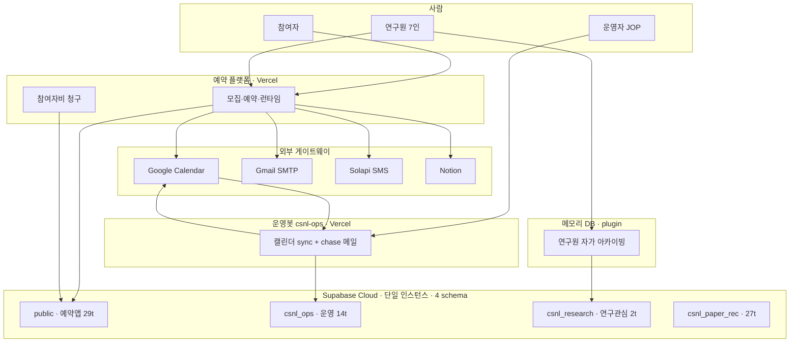
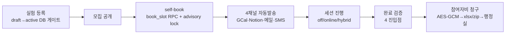
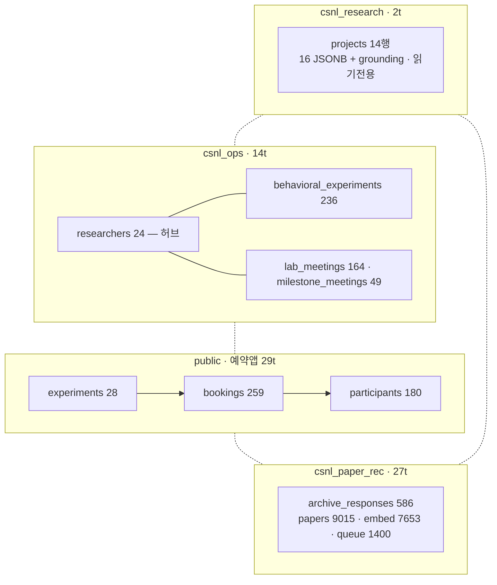
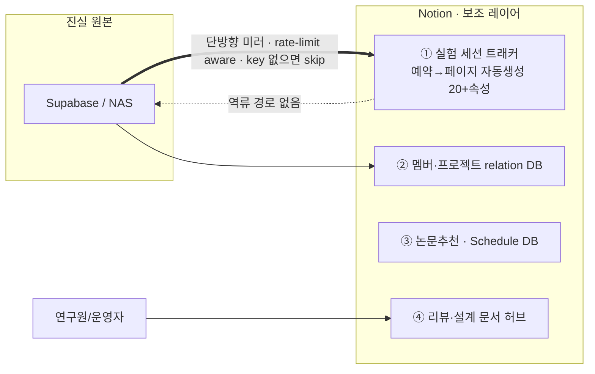
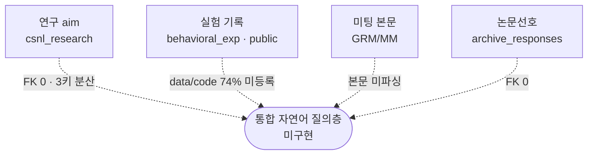

# CSNL 플랫폼 · Supabase DB · Notion 구현 수준 레포트

`2026-06-19` · 비주얼 리뷰 (다이어그램·테이블 중심)

**범위**: ① 예약 플랫폼 `Exp_Platform_by_Joonoh` ② Supabase DB ③ Notion 중심 (csnl-ops 운영봇·메모리 DB는 §6에 압축).
**방법**: 두 레포 전체 정적 분석 + Notion 설계도 ①② 라이브 수치(`2026-06-11` 스냅샷). Supabase는 스키마+스냅샷, Vercel은 코드+Actions로 평가(라이브 쿼리·런타임 미접속).

---

## 1. 성숙도 한눈

| 축 | 예약 플랫폼 | Supabase DB | Notion | csnl-ops 운영봇 | 메모리 DB |
|---|:---:|:---:|:---:|:---:|:---:|
| 배포/운영 | 🟢 라이브 | 🟢 단일 인스턴스 | 🟢 미러 운영 | 🟢 cron 5종 | 🟡 Phase-1 |
| 기능 완성도 | 🟢 전 사이클 | 🟡 적재 우수 | 🟡 단방향 | 🟡 좁은 범위 | 🟡 회수 동작 |
| 엔지니어링 품질 | 🟢 높음 | 🟢 앱 스키마 우수 | 🟢 견고 | 🟡 보통 | 🟢 grounding |
| 통합/연결 | 🟢 단일 FK trail | 🔴 cross-FK 0 | 🟡 미러만 | 🔴 분산 | 🔴 미연결 |
| 데이터 충실도 | 🟢 | 🔴 등록 74% 공백 | 🟡 | 🟡 | 🟡 6인 편차 |

🟢 제품 수준 · 🟡 운영 중·부분 · 🔴 미구현/공백

> **한 줄 진단** — 조각마다 완성도는 높다. 빠진 건 **조각을 잇는 통합 레이어**(cross-schema 연결 + 자연어 질의층)다.

---

## 2. 시스템 전체 지형

- 두 Vercel 앱(`예약 플랫폼` + `운영봇 csnl-ops`)이 **같은 Supabase 인스턴스의 다른 schema**를 씀.
- 예약 플랫폼만 외부 4 게이트웨이(GCal·Gmail·SMS·Notion)에 직접 발송.

---

## 3. 예약 플랫폼 — `Exp_Platform_by_Joonoh` 🟢 제품 수준 (라이브)

`https://lab-reservation-seven.vercel.app`

### 3.1 규모 · 스택

| 항목 | 값 |
|---|---|
| 스택 | Next.js 16 / React 19 · Supabase(PG+Storage+Auth) · Vercel |
| 마이그레이션 | **82** (`00001`–`00077` + drift fix) |
| API 라우트 | **~80** |
| React 컴포넌트 | **~45** |
| 서비스 레이어 | 25+ (email/SMS/Notion/GCal 재시도 분리) |
| GitHub Actions | **11** (CI + cron 9 + prod-smoke) |
| 외부 게이트웨이 | GCal · Gmail SMTP · Solapi SMS · Notion |
| 로컬 LLM | Ollama (`/api/ai/*` 코드분석·embed·OCR) |

### 3.2 전 사이클 커버

### 3.3 엔지니어링 품질 vs 리스크

| 강점 | 리스크/미완 |
|---|---|
| RLS · 민감정보 AES-GCM 암호화 · PII 마스킹 · salt rotation | **Bus factor = 1 (JOP)** |
| outbox 패턴 **2종** + dead-letter + 멱등키(GCal eventId=bookingId) | Slack 웹훅·cron 실패 알림 배선 미완 (`PENDING-OPERATOR-ACTIONS.md`) |
| append-only 감사 테이블 · `/api/health/*` · notion-health cron | 취소 후 동시간 재예약 시 GCal 지연(orphan-reaper로 해소) |
| CI(`tsc`·drift 검사) · forkable·`$0/month`·lab-sovereign · 논문 초안 동봉 | — |

---

## 4. Supabase DB 🟡 적재 우수 / 통합 미구현

**단일 Supabase Cloud(Seoul) · 4 schema · 72 table · 내부 FK 51 · cross-schema FK 0** (Notion ①②, `2026-06-11`).

### 4.1 "4개의 섬"

> 점선 = **스키마 간 직접 FK 0**. 공통 키(연구원 이니셜)는 3영역에서 일치 검증됐으나 그 키로 FK가 안 걸려 있음 → 결정적 join 불가, 이니셜+제목 휴리스틱 매칭만 가능.

### 4.2 강점 ↔ 갭

| 강점 | 갭 |
|---|---|
| `public` 앱 스키마: RLS·트리거·RPC·제약 촘촘 (82 마이그레이션 클린) | cross-schema FK **0** — aim ↔ 실험 ↔ 논문선호 단절 |
| `csnl_research.projects`: grounding(출처)+confidence 붙은 16-필드 JSONB | 'project' 키 **3종 분산** — `slug`/`code`/`project_name` |
| 이니셜 키 3영역 일치 검증 | 실험 data/code **74% 미등록** (활성 169 중 125) |
| — | 미팅 본문 미파싱 (GRM 20 + MM 19 메타만) |
| — | 빈/죽은 테이블 (`project_embeddings` 0행 등) · 통합 질의층 미구현 |

### 4.3 등록 공백 (활성 169 세션)

| 연구원 | 세션 | data/code 등록 |
|---|---:|---|
| JOP | 44 | 🟢 44/44 (100%) |
| BYL | 103 | 🔴 0/103 |
| SMJ | 16 | 🔴 0/16 |
| BHL | 6 | 🔴 0/6 |

> 데이터는 존재, **등록만 누락**. 실데이터 활용(심층탐색·논문작성 보조)은 사실상 JOP에서만 작동.

---

## 5. Notion 🟡 미러+문서 견고 / 보조 레이어

| 견고성 | 한계 |
|---|---|
| 단방향·rate-limit aware(`notion/rate-limit.ts`) | **단방향** — Notion 편집이 DB로 역류 안 함 |
| `NOTION_API_KEY` 없으면 자동 skip (타 기능 무영향) | Notion은 미러+사람작성 문서, source-of-truth 아님 |
| notion-health cron + outbox 재시도 · 실패 시 PII 미기록 | 문서 본문(슬라이드 등) DB 구조화 추출 안 됨 (§4 갭과 동일) |

---

## 6. csnl-ops 운영봇 · 메모리 DB (압축)

| 갈래 | 내용 | 성숙도 |
|---|---|---|
| Vercel 운영봇 | cron 5종(`sync-slab`·`sync-csnl-mm`·`sync-lab-meetings`·`ingest-experiments`·`chase-mm-slides`). GCal→`csnl_ops.*` 정리 + 발표자료 chase 메일. NAS 미접근. | 🟢 안정·좁음 |
| 메모리 DB | `researcher-archiver-plugin`이 각 PC 세션에서 NAS 자가 아카이빙→`csnl_research.projects`(PK `(init,project_slug)`, RLS, 낙관적 CAS). 16 JSONB+grounding+confidence 설계 우수. | 🟡 Phase-1 |
| 미완 | `project_embeddings`(pgvector bge-m3) **0행**, Slack harness 레거시 대체 중, 일관성은 사람 검수 의존. | 🔴 |

---

## 7. 종합 — 끊어진 다리 & 권고

> **가장 큰 단일 갭**: 4 schema를 이니셜/프로젝트 키로 잇는 대응표·뷰 + 그 위 자연어 질의층 부재. "이 연구자의 aim ↔ 실험 데이터 ↔ 미팅 논의 ↔ 논문선호"를 한 번에 답하지 못함.

### 권고 (비용·효과 순)

| # | 권고 | 효과 | 비용 |
|---|---|---|:---:|
| 1 | **사람 키 연결 뷰** — 검증된 이니셜로 4영역 cross-schema 뷰 1개 | 즉시 통합 질의 토대 | 🟢 저 |
| 2 | **프로젝트 키 대응표** — `slug↔code↔project_name` + 실험행 aim 태그 | 결정적 join 가능 | 🟡 중 |
| 3 | **등록 게이트** — 실험 로깅 시 `data_path`·`code_repo_url` 강제 | 74% 공백 재발 방지 | 🟢 저 |
| 4 | **미팅 본문 층** — GRM/MM 슬라이드 텍스트 추출 → 질의 가능 | 논의·실패가설 회수 | 🔴 고 |
| 5 | **임베딩 레이어 가동** — `project_embeddings` 채움 | 자연어 질의 정밀도 | 🟡 중 |
| 6 | **Notion 역류 경로(선택)** — 연구자 입력 메타 DB 회수 | 단방향 한계 해소 | 🟡 중 |

---

### 부록 — 출처 · 한계
- 플랫폼 규모: `Exp_Platform_by_Joonoh` 클론 정적 카운트(마이그레이션/라우트/워크플로).
- 아키텍처: `docs/architecture/blueprint.md` · `db-structure.md` · `notion-db-template.md` · `DEPLOY.md`.
- DB 라이브 수치: Notion `① 설계도 가이드` / `② 메타리뷰` (`2026-06-11`).
- csnl-ops: 본 레포 `README.md` · `docs/snapshot.md` · 마이그레이션.
- **미검증**: Vercel 런타임, Supabase 라이브 쿼리(운영자 합의로 스키마+스냅샷 평가).
